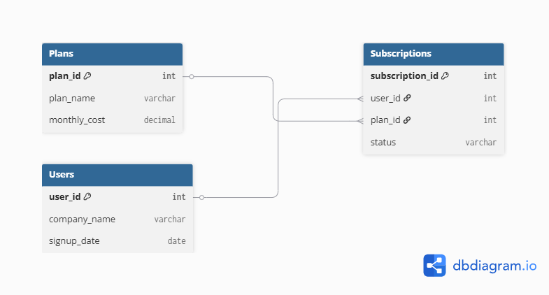

# Saas Subscription Analytics & Data
## Business Overview
This project designs and implements a relational database schema for a modern Software-as-a-service (Saas) platform. The primary goal is to provide data-driven business insights by tracking core operational metrics, including **Monthly Recurring Revenue (MRR)**, user subscription tier distribution, and active customer behaviour.

## Table of Contents
* [Database  Architecture ](#-database-architecture)
* [Business Insights & Analytical Queries](#-business-insight-_analytical-queries)
  * [1. Calculating Active MRR](#1-financial_health-calculating-active-mrr)
  *  [2. Plan Popularity & Churn Breakdown](#2-product-analytics-plan-popularity-churn-breakdown)
  *  [3. Identiying VIP Accounts](#3-executive-report-identifying-vvip-accounts-dynamic-subquery)
* [Key Technical Conecpts Demonstrated](#-key-technical-concepts-demonstrated)

## Database Architecture(Schema & ERD)
The architecture consists of three highly structured tables designed with strict data integrity safeguards ('NOT NULL' constarints, positive value 'CHECK' rules, and explicit 'FOREIGN KEY' relationships).


## Business Insights & Analytical Queries
### 1. Financial Health: Calculating Active MRR
**Business Problem**: The executive and finance teams need to know the exact Monthly Recurring Revenue(MRR) actively generated by the platform today.

```sql
SELECT SUM(p.monthly_cost) AS total_active_mrr
FROM Plans AS p 
INNER JOIN Subscriptions AS s
USING(plan_id)
WHERE s.status = 'Active';
 ```     
**Output:**
|total_active_mrr|
|:---------------|
|388.00          |

### 2. Product Analytics: Plan Popularity & Churn Breakdown
**Business Problem**: The product team wants a breakdown of customer distribution across different tiers alongside their lifecycle status to spot churn trends

```sql
SELECT p.plan_name, COUNT(u.user_id) AS total_users, s.status
FROM Plans AS p
INNER JOIN Subscriptions AS s
USING (plan_id)
INNER JOIN Users AS u
USING(user_id)
GROUP BY p.plan_name, s.status;
```
**Output**
| plan_name  | total users | status  |
|:---------  |:------------|:--------|
|Pro Startup | 1           | Active  |
|Pro Startup | 1           | Churned |
|Enterprise  | 1           | Active  |
|Free Tier   | 1           | Active  |

### 3. Executive Report: Identifying VIP Accounts (Dynamic Subquery)
**Business Problem**: The CEO requires a real-time list of top-tier accounts spending significantly more than the platform's overall active average.

```sql
SELECT company_name
FROM Users
INNER JOIN Subscriptions USING(user_id)
INNER JOIN Plans USING(id)
WHERE monthly_cost > (
    SELECT AVG(p.monthly_cost)
    FROM Plans AS p
    INNER JOIN Subscriptions AS s USING(plan_id)
    WHERE s.status = 'Active'
);
```
**Output**
|company_name|
|:-----------|
|Acme Corp   |

## Key Technical Concepts Demonstrated
- **Relational Database Design**: Enforced strict data constraints (CHECK, UNIQUE, NOT NULL) to prevent database corruption.

- **Complex Data Joining**: Orchestrated multiple table links seamlessly using optimized USING clauses.

- **Advanced Aggregations**: Utilized arithmetic grouping (SUM, COUNT) to map technical metrics to business metrics.

- **Nested Subqueries**: Implemented dynamic filtering to isolate records relative to fluctuating mathematical means.


